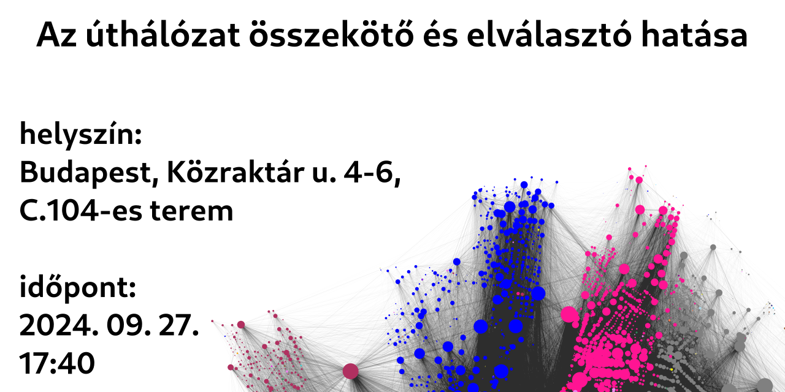

# Az úthálózat összekötő és elválasztó hatása - előadásdiák

## a szekció teljes programja

| időpont     | előadó             | cím                                                                                   |
|-------------|--------------------|---------------------------------------------------------------------------------------|
| 16:30-16:40 | Lőrincz László     | Bemutatkozik a hálózattudományi tanszék, Social Data Science Porgram rövid bemutatása |
| 16:40-16:55 | Szabó Rebeka       | A szabadulószobák, mint társas laboratóriumok                                         |
| 16:55-17:10 | Tóth Gergő         | Antidepresszánsok és társas kapcsolataink                                             |
| 17:10-17:25 | Vásárhelyi Orsolya | Szexista a ChatGPT?                                                                   |
| 17:25-17:40 | Németh Brigitta    | Független innovációs közösségek centralizált finanszírozásának buktatói               |
| 17:40-17:55 | Pintér Gergő       | Az úthálózat összekötő és elválasztó hatása                                           |
| 17:55-18:10 | Boza Endre         | Rankless                                                                              |

